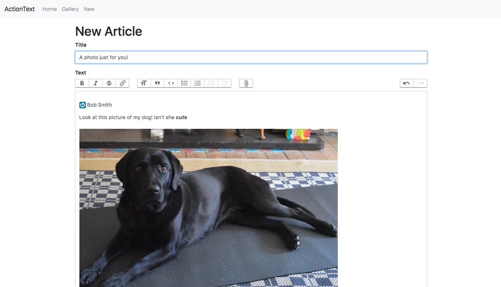
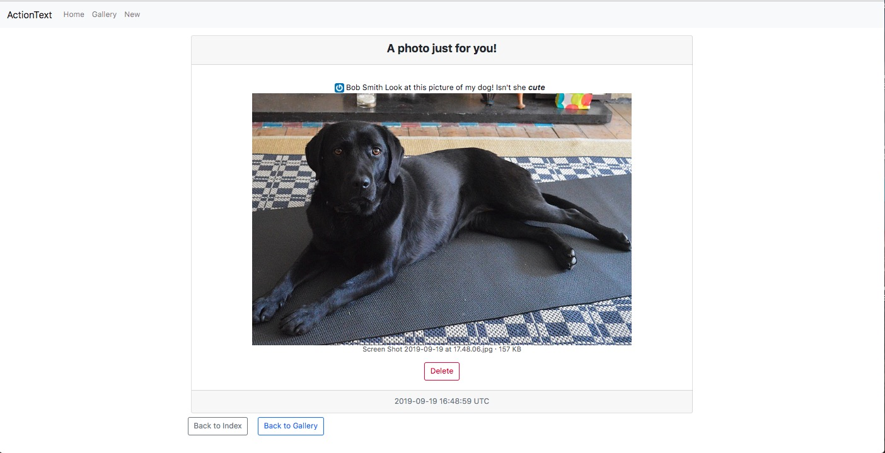
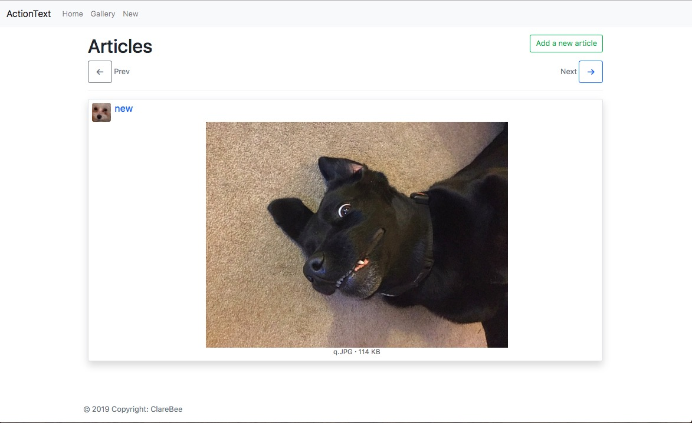
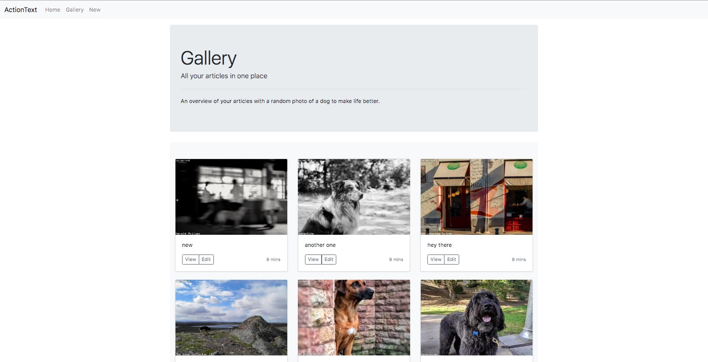

## The Project
Originating with the Rails Guide:
https://edgeguides.rubyonrails.org/action_text_overview.html

Expanded with GoRails but using Webpack instead:
https://gorails.com/episodes/how-to-use-action-text?autoplay=1

Expanded with Stimulus slideshow as a way of experimenting w the framework

Trix - out-of-the-box text editing





## Learning Notes

**Styling & Development**
Initial commit:
```
rails new action_text_app --skip-coffee --skip-sprockets --skip-turbolinks --webpack --database=postgresql  -T
```
Using Foreman:
Process manager to run webpack-dev-server in the background for hot reload
- touch Procfile
- add:
```
server: bin/rails server
assets: bin/webpack-dev-server
```

```
gem install foreman
```
```
foreman start
```
Using `stylesheet_pack_tag` in application.html.erb to load css w webpack via application.js

`yarn add normalize.css`
>Normalize.css makes browsers render all elements more consistently and in line with modern standards. It precisely targets only the styles that need normalizing.

https://necolas.github.io/normalize.css/

**ActionText**
```
rails action_text:install
```

- needs Active Storage
```
rails active_storage:install
```
- uncomment in Gemfile (ImageMagick re: image resizing)
```ruby
# Use Active Storage variant
gem 'image_processing', '~> 1.2'

```
**Tribute.js**
>A cross-browser @mention engine written in ES6, no dependencies.

https://github.com/zurb/tribute
For a collection dropdown

```
yarn add tributejs

```
**Stimulus.js**
Basecamp's https://stimulusjs.org/handbook/origin

3 Main Concepts: Controllers, Actions, Targets
- main aim to manipulate the DOM, grabbing targets via data attributes (get(), set(), has())
e.g. (Src: [Stimulus](https://stimulusjs.org/handbook/origin))
```javascript
// src/controllers/hello_controller.js
import { Controller } from "stimulus"

export default class extends Controller {
  static targets = [ "name" ]
  greet() {
    console.log(`Hello, ${this.name}!`)
  }

  get name() {
    return this.nameTarget.value
  }
}
```
```html
<!-- index.html.erb -->
<div data-controller="hello">
  <input data-target="hello.name" type="text">
  <button data-action="click->hello#greet">Greet</button>
</div>
```
```
rails webpacker:install:stimulus
```
- to coordinate Trix & Tribute JavaScript

**Devise 4.7.1**
`gem 'devise'`
`bundle install`
`rails g devise:install`

Follow console instructions:
1. Ensure you have defined default url options in your environments files. Here
     is an example of default_url_options appropriate for a development environment
     in config/environments/development.rb:

       `config.action_mailer.default_url_options = { host: 'localhost', port: 3000 }`

     In production, :host should be set to the actual host of your application.

  2. Ensure you have defined root_url to *something* in your config/routes.rb.
     For example:

       `root to: "home#index"`

  3. Ensure you have flash messages in app/views/layouts/application.html.erb.
     For example:
      ```html
       <p class="notice"><%= notice %></p>
       <p class="alert"><%= alert %></p>
       ```

  4. You can copy Devise views (for customisation) to your app by running:

       `rails g devise:views`

`rails generate devise User`
`rails db:migrate`

Handy available methods:
```
before_action :authenticate_user!
user_signed_in?
user_session
current_user
```
SEE https://github.com/plataformatec/devise for config/params/customisation etc.
